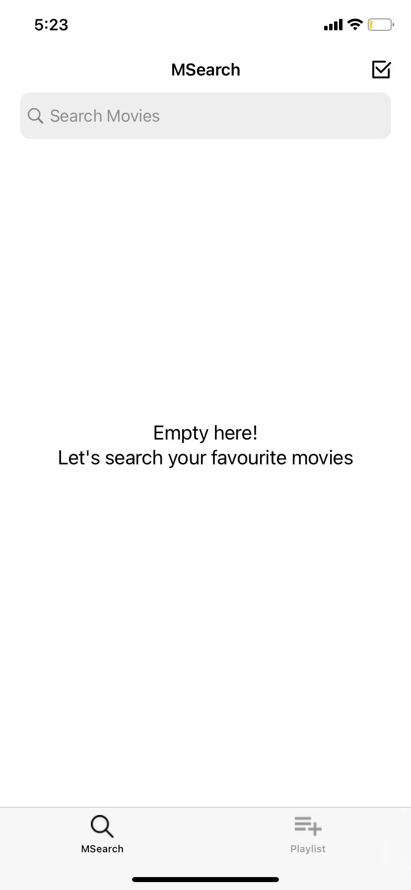
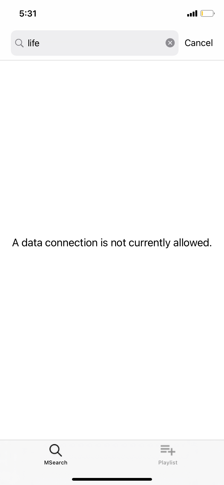

MSearch: Search your favorite movies from OMDB API
======================================

```MSearch``` is a quick reference implementation which allows a user to search for, and create a playlist from movies provided by the OMDB.

## How It Works
I think it can be best described using screenshots below. Key functionalities includes search, select favorite movies and add to playlist:
<p float="left">
  
  
  
</p>

<p float="left">



</p>

## What's Inside
The app uses MVVM to separate responsibility of different objects. Apart from general MVVM layers it contains a reusable layer for Networking with support for image caching.</p>
PS: All the layers/components can be further extended/improved for production use.


## Tools & Support
1.  Xcode 12.3, Build version 12C33.
2.  Swift 5.3 and later.
3.  iOS 12 and later.

## License
MSearch is licensed under the [MIT License](LICENSE.md).
